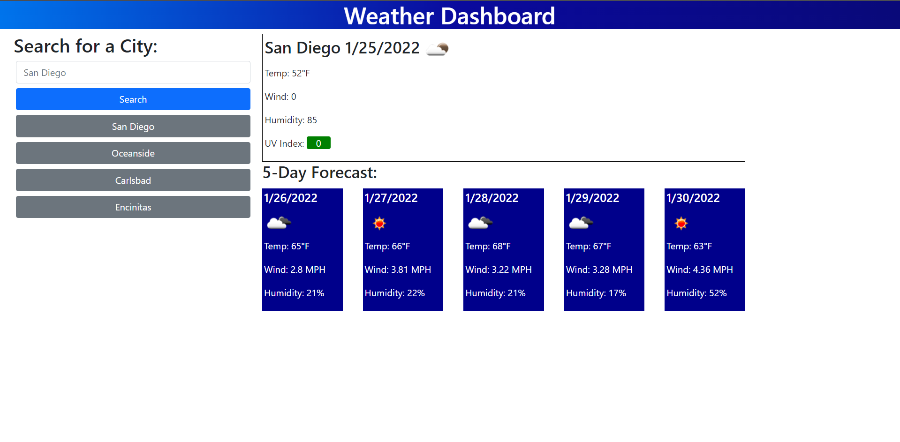

# homework_06
Server Side API Homework

The goal of this homework was to test and expand our knowledge of server side API's and HTTP (fetch) requests to those APIs by building a weather website from scratch.

This particular website employs a lot of relatively static coad, and as a result I built it using a balanced combination of HTML elements populated bia Javascript.

The meat of this project(the Open Weather API) added a definite layer of complexity, especially as it wouldn't allow us to meet the user requirements requirements using a single API call. It actually required one API call to convert the searched city into lat/long coordinates. Then another call using those coordinates to get the necessary weather data via the OneCall API. 

See the live site here: https://windwalker-92.github.io/homework_06/

The user requirements were as follows:
WHEN I search for a city
THEN I am presented with current and future conditions for that city and that city is added to the search history
 - I accomplished this by converting the city to lat/long and using those coordinates to pull the weather. The city was saved in a list in local storage for later use.

WHEN I view current weather conditions for that city
THEN I am presented with the city name, the date, an icon representation of weather conditions, the temperature, the humidity, the wind speed, and the UV index
 - I populated the weather elements with data from the OneCall API

WHEN I view the UV index
THEN I am presented with a color that indicates whether the conditions are favorable, moderate, or severe
 - I dynamically assign the UV index span a background color class based on the severity

WHEN I view future weather conditions for that city
THEN I am presented with a 5-day forecast that displays the date, an icon representation of weather conditions, the temperature, the wind speed, and the humidity
 - I populated the future weather cards with data from the OneCall API
 
WHEN I click on a city in the search history
THEN I am again presented with current and future conditions for that city
 - I loaded the recently cities as buttons. When one of them is clicked, it searches that city. It does not re-add that city to the recently searched list.

 See below for a screenshot.
 